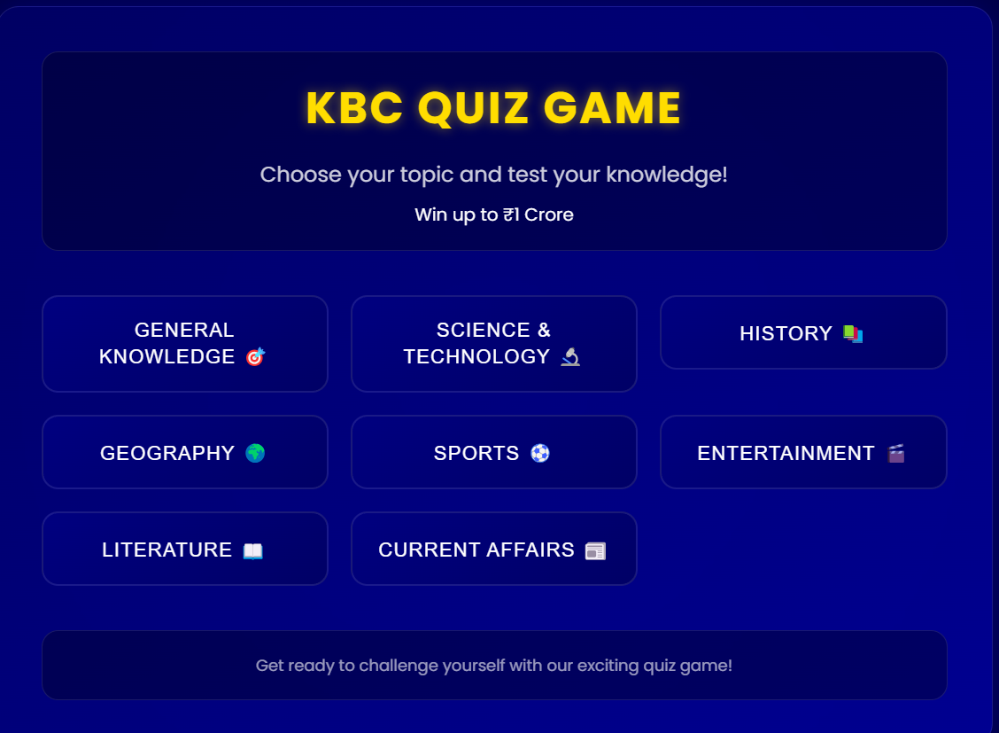
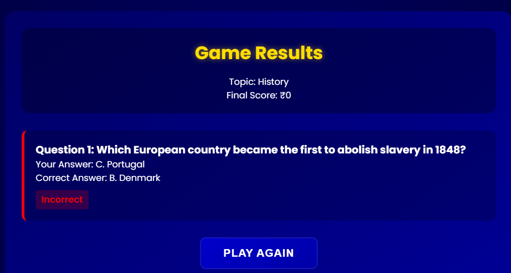

# KBC Quiz Game 🎮

A web-based quiz game inspired by "Who Wants to Be a Millionaire" (Kaun Banega Crorepati), built using Node.js, Express, and the Gemini AI API.

## Screenshots

### Topic Selection

*Choose from various topics like General Knowledge, Science & Technology, History, and more.*

### Game Play

*Answer questions and win up to ₹1 Crore! Each correct answer increases your prize money.*

## Features

- 🎯 Multiple Topics
  - General Knowledge
  - Science & Technology
  - History
  - Geography
  - Sports
  - Entertainment
  - Literature
  - Current Affairs

- 🎲 Game Mechanics
  - Progressive difficulty
  - 15 questions per game
  - Prize money increases with each correct answer
  - Instant feedback on answers
  - Detailed results page

- 🎨 Modern UI/UX
  - Responsive design
  - Smooth animations
  - Topic-specific icons
  - Visual feedback for answers

## Technology Stack

- **Backend**: Node.js + Express.js
- **Frontend**: EJS + Custom CSS
- **AI**: Google's Gemini AI API
- **Database**: In-memory session storage

## Code Structure

```
KBC/
├── src/
│   ├── app.js              # Main server file
│   ├── views/
│   │   ├── topic-selection.ejs  # Topic selection page
│   │   ├── game.ejs            # Game interface
│   │   └── error.ejs           # Error handling page
│   └── public/              # Static assets
├── .env                    # Environment variables
├── package.json           # Dependencies
└── README.md             # Documentation
```

### Key Components

1. **Question Generation (`app.js`)**
```javascript
async function generateMcq(topic, questionNumber) {
    const model = genAI.getGenerativeModel({ model: "gemini-pro" });
    // Uses Gemini AI to generate topic-specific questions
    // Ensures progressive difficulty
    // Validates response format
}
```

2. **Answer Validation (`app.js`)**
```javascript
app.post('/check-answer', async (req, res) => {
    // Validates user answers
    // Updates game state
    // Handles game progression
});
```

3. **Game State Management**
```javascript
const gameStates = new Map();
// Tracks:
// - Current question
// - Score
// - Question history
// - User answers
```

## Setup Instructions

1. **Clone the Repository**
```bash
git clone https://github.com/yourusername/KBC.git
cd KBC
```

2. **Install Dependencies**
```bash
npm install
```

3. **Configure Environment**
Create a `.env` file:
```env
GEMINI_API_KEY=your_api_key_here
PORT=3000
```

4. **Start the Server**
```bash
npm start
```

5. **Access the Game**
Open `http://localhost:3000` in your browser

## Game Flow

1. User selects a topic
2. Server generates a question using Gemini AI
3. User selects an answer
4. Server validates and provides feedback
5. Process repeats until:
   - Wrong answer (game over)
   - All 15 questions completed (winner!)
6. Final results displayed

## Prize Money Structure

- Question 1: ₹1,000
- Question 5: ₹10,000
- Question 10: ₹3,20,000
- Question 15: ₹1 Crore

## Contributing

1. Fork the repository
2. Create a feature branch
3. Commit your changes
4. Push to the branch
5. Create a Pull Request

## License

This project is licensed under the MIT License - see the LICENSE file for details.

## Acknowledgments

- Inspired by the TV show "Kaun Banega Crorepati"
- Powered by Google's Gemini AI
- Built with Node.js and Express.js

---
